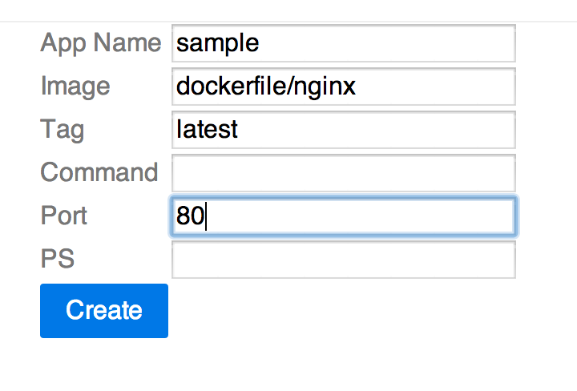
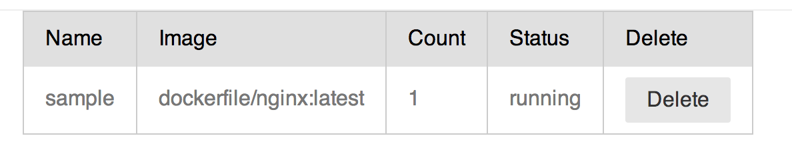
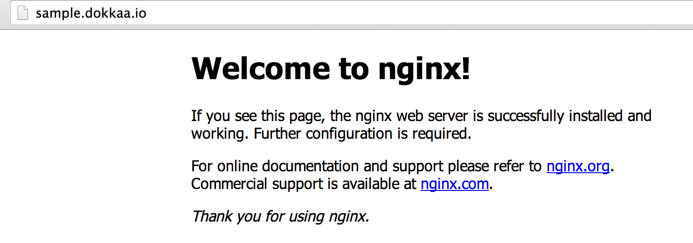
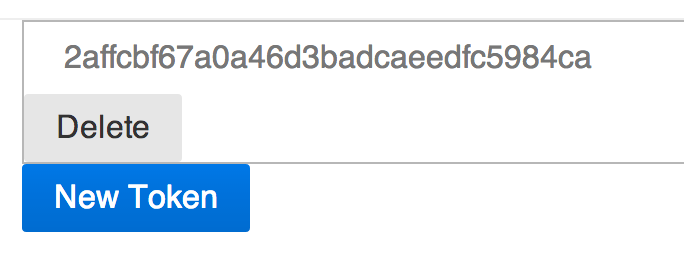
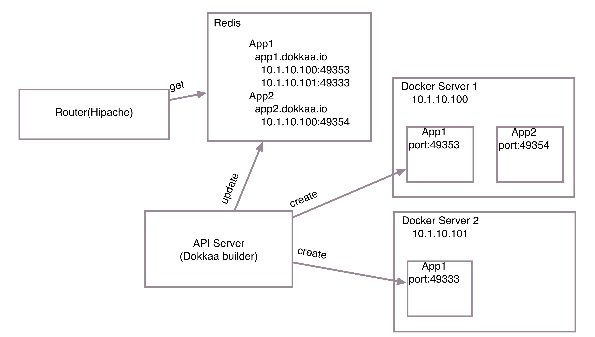

## DokkaaでドッカドッカDocker

<br />

Kazunori Kajihiro

[@k2nr_](https://twitter.com/k2nr_)

---

Dockerのホスティングサービスみたいなの作ってる話

---

* Docker流行ってますね
* 楽しそう
* Dockerで何ができるか色々実験したい
* そうだ、PaaSをつくろう

---

# Dokkaa

* https://github.com/k2nr/dokkaa-builder
* http://dokkaa.io
  * ↑(金がないから)そのうち取得する予定
  * 誰も取るなよ

---

イメージ名とかを指定してcreateすると



---

コンテナが走る



---

URLができて、アクセスできる



---

APIトークンをつくって



REST APIでも操作できる

```
$ curl -X POST http://dokkaa.io/apps/sample?image=dockerfile/nginx&port=80&api-token=2affcbf67a0a46d3badcaeedfc5984ca
```

---

## 使ってる技術

* Clojure / ClojureScript
* [Hipache](https://github.com/dotcloud/hipache)
* [Docker](http://www.docker.com/)
* [Om](https://github.com/swannodette/om)
  * [React](http://facebook.github.io/react/)のcljs wrapper
* Redis
* etcd

---

## 概要



---

## 今後の展望

* 1つのAppで複数種類のコンテナ
* コンテナ間のリンク
* ログへのアクセス
* マルチドメイン
* etc...

---

## なぜ個人開発するか

* 開発を楽しむ
* 好きな言語を使って
* なんか楽しそうなライブラリを使って
* 楽しむ

---

## なぜ個人開発するか

* 役に立つか、とか
* 便利か、とか
* 金になるか、とか
* どうでもいい

---

## なぜ個人開発するか

* Dokkaaを僕個人が使いたいかどうかすら怪しい
* その開発が楽しいかどうか。楽しくなくなったらやめる

---

とはいえ、せっかく作ってるので

## プルリクエスト待ってます
