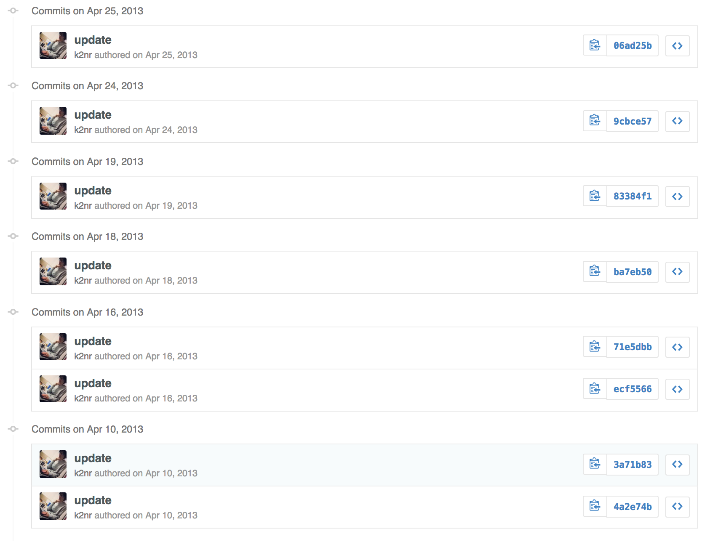

## コードレビュー勉強会
<br />

Kazunori Kajihiro

---

## 目的

- 「レビューとは何か」について全員共通の見解を得る
  - レビューの目的
  - レビューのしかた
  - レビューのされかた

---

## レビューの目的

- ソースコードの品質の向上
- 設計/コーディングに関する意識の統一
- 教育
- 仕様の確認
- バグがない状態でレビューされる姿勢

---

## 設計のレビュー

「どのような設計にするのか」が、コードを書く前にチーム内で共有され、了解がとれているべき

- コードが出来上がって
- プルリクがオープンされて
- **「全然違うじゃねーか全部書き直せ」**
- ということを防ぐ

---

### 設計書を書く

- 目的はドキュメントを残すことではなく**チーム内で設計に関する合意を取る**こと
- 方法はどんなものでもよいが、ドキュメントをベースに議論が出来る場であることが必須
  - 例えば...
  - 空のプルリクエストをオープンして、どのような設計にするのか説明を記述する
  - Confluenceに説明を書く

---

## ソースコードレビュー観点

すべてのレビューは、**どのような観点でレビューするのか**が明確でなければならない

---

## ソースコードレビュー観点

- 観点が不明確な状態ではレビュー漏れや不要な議論が発生してしまう
- レビュー観点はプルリクの性質で違う
  - 機能追加、バグ修正、etc...
- チーム内でレビュー観点を共有しておこう

---

### ケース1: スクラッチ開発である機能を実装した一発目のプルリク

- 設計に問題がないか？(合意を得た設計通りの実装か？)
  - 変更に対して開いた設計か？
  - 過度に抽象化されていないか？
  - DBスキーマは適切か？
- 仕様を満たせているか？

---

### ケース2: 機能をリリース後のHot Fix

- 既存機能がバグらないか？
- 修正に漏れはないか？

---

### どんな観点が必要か考えてみよう

- 保守しやすいか
  - グローバル変数とか
  - テンプレートにロジック
- 名前が適切か
- 読みやすいか
- DRYか
- 慣習に従っているか
  - forよりeach
  - Railsのレールに乗ってるか
- 学びやすいか
- テストがあるか
- テストはAll Greenになっているか

---

### レビューイーも観点を伝えよう

どのようなレビューをしてもらいたいのか、レビューイーが説明しよう

- 「DBスキーマのxxxテーブルとxxxテーブルの関連はこれで適切でしょうか？」
- 「xxxの部分が少し設計が雑な気がするのですがもっと良い方法はないですか？」

---

### 指摘のレベル

その指摘は...

- 絶対に修正しなければならないものなのか
- できれば修正した方がよいものなのか
- 質問なのか
- ただの感想や雑学なのか

---

### 指摘のレベル

指摘毎に「どのレベルなのか」示すのが望ましい

- `[必須]`、`[質問]`みたいな指摘のプリフィックスをルール化しておくといいかも

---

### なぜその指摘が必要なのか

```ruby
  scope :listing, -> { where(active: true) }
```

- × スコープの名前おかしいので変えてください
- ○ `listing`という名前が`active`なレコードだけを取ってくる動作を示していません。動きの想像がつく名前に変更してください

---

### 瑣末な指摘を避ける

```ruby
def some_method(a,b={:key => 1})
  a + b[:key]
end
```

---

### 瑣末な指摘を避ける

- 「引数のカンマの後、スペース入れた方がよくね？」
- 「ハッシュの書き方、`key: 1`の方がよくね？」
- 「ちゃんと`return`書いた方が分かりやすくね？」

---

## 瑣末な指摘を避ける

- 例の3つは基本的に個人の好みの領域
- どれが絶対的に優れていると決めることはできない
- → 宗教論争
- こういう指摘をする代わりに静的解析ツールを導入しよう
  - [Rubocop](https://github.com/bbatsov/rubocop)
  - JSLint
  - etc...

---

## レビューイーの心構え

---

### プルリクエストの説明

- どのような変更を加えたのか
  - 機能追加なら仕様の概要(JIRAのリンクとか)
  - バグ修正ならバグの概要
- なぜその変更が必要なのか
- 重点的にレビューしてもらいたい点

---

### コミット単位

- コミット単位は細かく
- 関連のない変更を同じコミットにしない

---

### 説明的なコミットメッセージ

- 「変更」だけじゃ分からない

---



---

### 説明的なコミットメッセージ

- 「どのような」変更か、「なぜ」その変更が必要なのか
- 1行目に概要、必要なら2行目以降に詳細な説明

---

### HRT(Huminity, Respect, Trust)

[Team Geek ―Googleのギークたちはいかにしてチームを作るのか](http://www.amazon.co.jp/Team-Geek-%E2%80%95Google%E3%81%AE%E3%82%AE%E3%83%BC%E3%82%AF%E3%81%9F%E3%81%A1%E3%81%AF%E3%81%84%E3%81%8B%E3%81%AB%E3%81%97%E3%81%A6%E3%83%81%E3%83%BC%E3%83%A0%E3%82%92%E4%BD%9C%E3%82%8B%E3%81%AE%E3%81%8B-Brian-Fitzpatrick/dp/4873116309/ref=sr_1_1?s=books&ie=UTF8&qid=1412311726&sr=1-1&keywords=%E3%83%81%E3%83%BC%E3%83%A0%E3%82%AE%E3%83%BC%E3%82%AF)

---

### HRT(Huminity, Respect, Trust)

- Huminity 謙虚
- Respect 尊敬
- Trust 信頼

---

### HRT(Huminity, Respect, Trust)

- 相手を見下さない
- 馬鹿にしない
