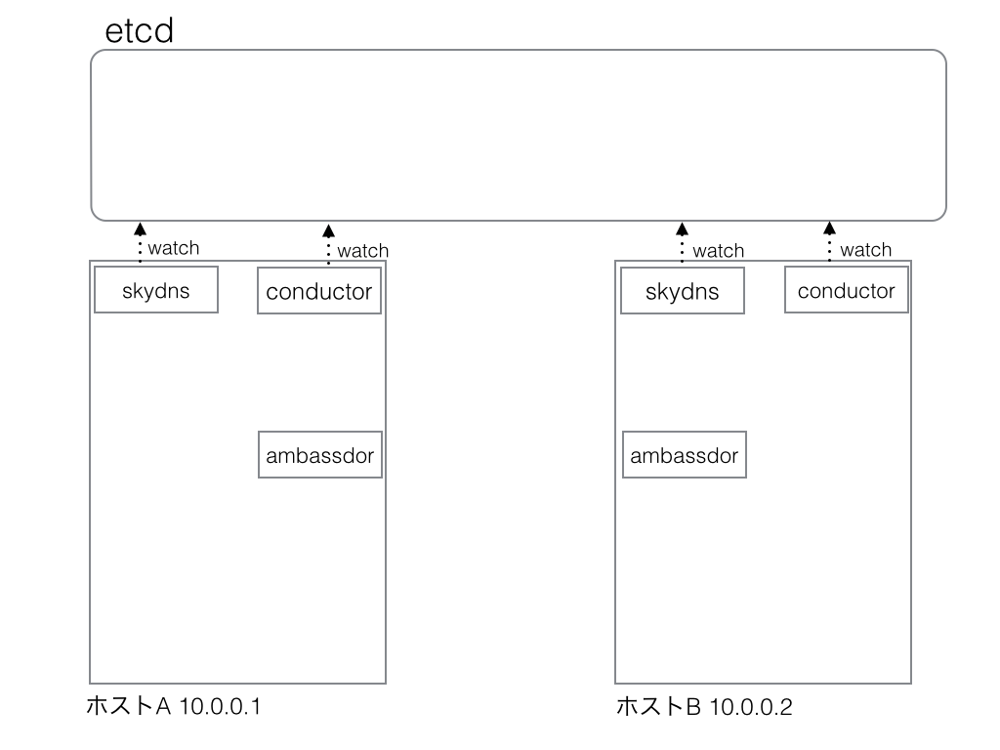
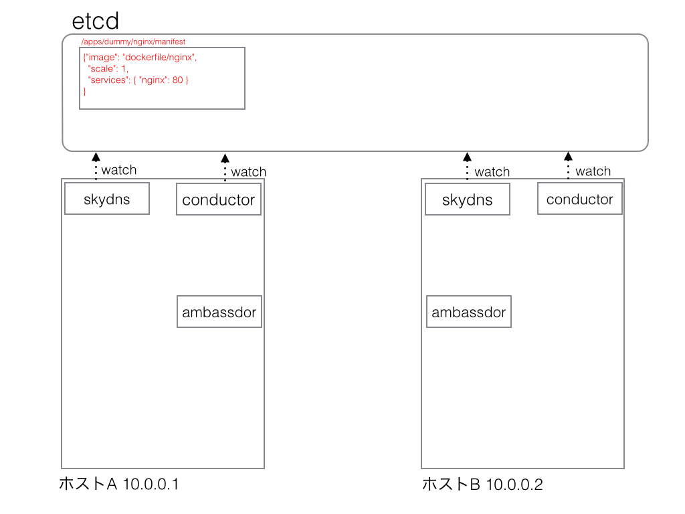
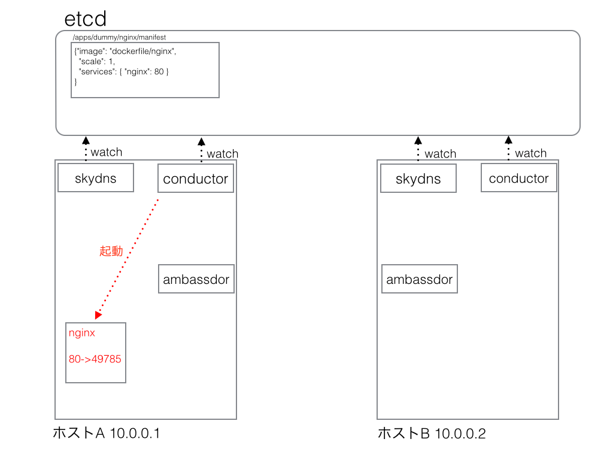
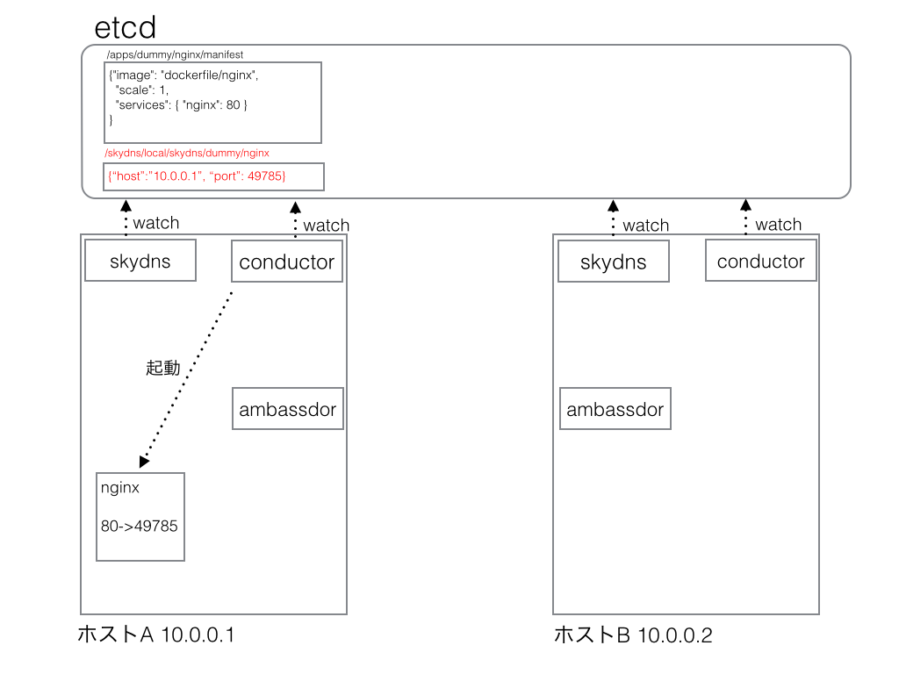
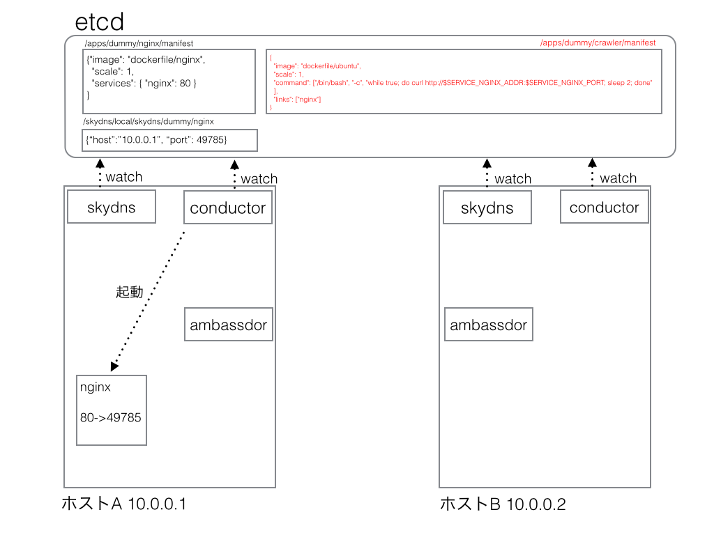
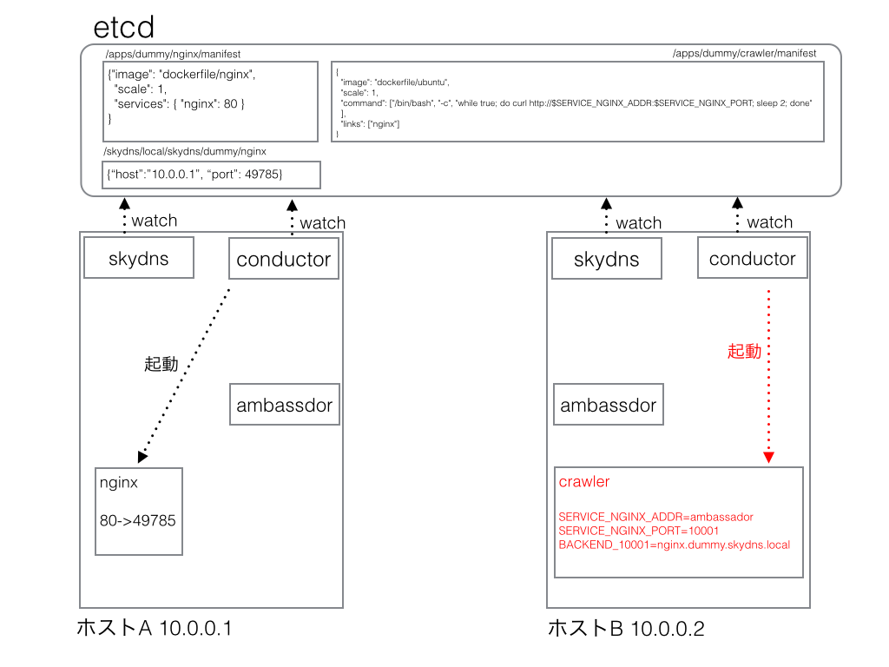
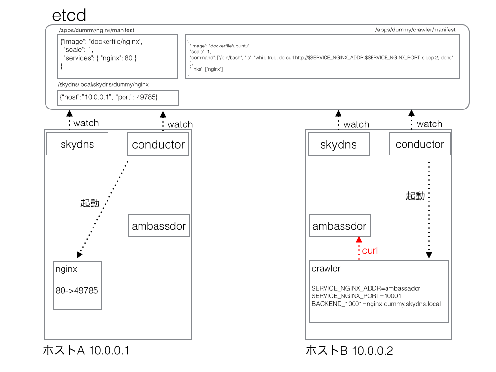
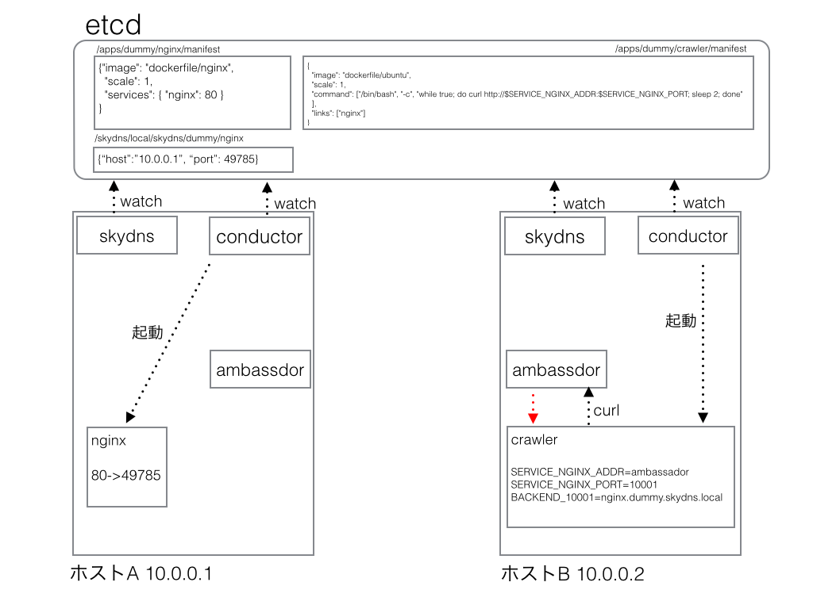
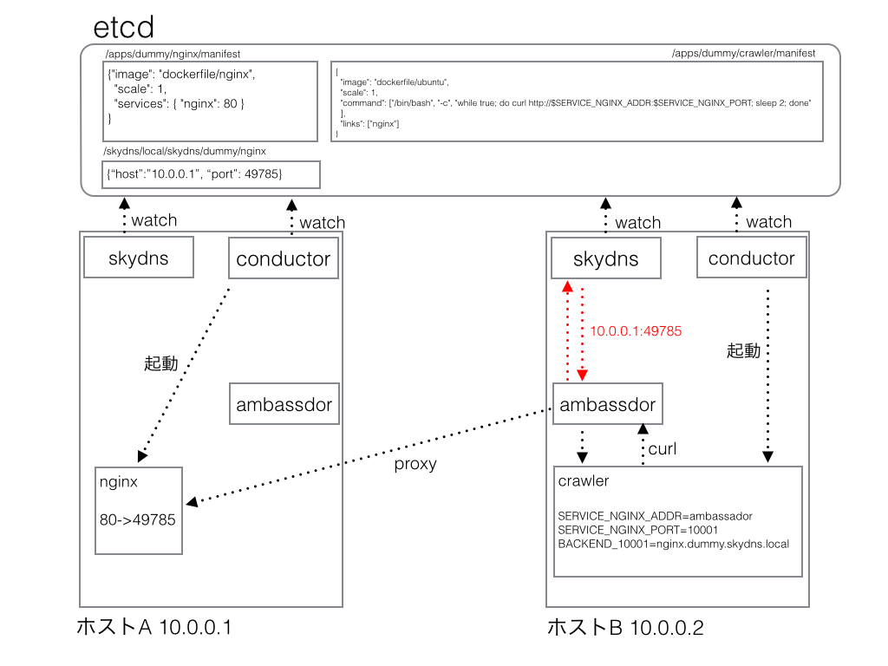
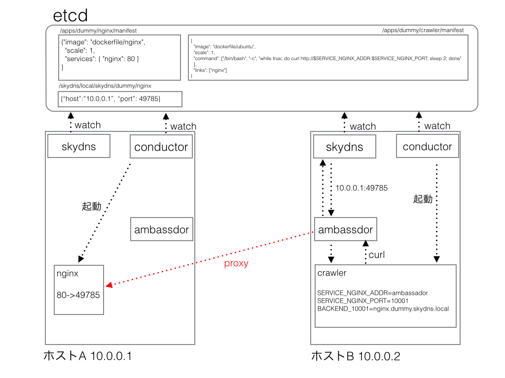

# Dokkaa

Dokkaaはマルチホスト・マルチコンテナ環境におけるdockerコンテナクラスタのオーケストレーション、サービスディスカバリ、ヘルスチェック、オートスケーリング等を管理するツールです。

## ソースコード

dokkaaは複数のレポジトリで開発しています。

- [dokkaa](https://github.com/k2nr/dokkaa)
  - dokkaaのセントラルレポジトリです。ドキュメントのみでコードはありません。
- [dokkaa-conductor](https://github.com/k2nr/dokkaa-conductor)
  - 後述するconductorのソースコードです。golangで書かれています。
- [dokkaa-ambassador](https://github.com/k2nr/dokkaa-ambassador)
  - 後述するambassadorのソースコードです。golangで書かれています。
- [dokkaacfg](https://github.com/k2nr/dokkaacfg)
  - dokkaaクラスタ自体の操作を行うためのコマンドラインツールです。rubyで書かれています。
- [skydns-docker](https://github.com/k2nr/skydns-docker)
  - skydnsのdockerイメージです。
- [dokkaa-builder](https://github.com/k2nr/dokkaa-builder)
  - 将来dokkaaで使う予定のモジュールです。本ドキュメントには出てきません。dokkaaのetcdの操作等を受け持つAPIサービスです。clojureで書かれています。

## 開発の動機

dockerをマルチホストで扱うためには(現状dockerだけでは解決できない)多くの課題があります。
Dokkaaの目的はマルチホストでのコンテナクラスタを管理する際に発生する問題を解決して、シンプルにクラスタを管理できるようにすることです。

Dokkaaが解決しようとしている問題は大きく分けて以下の4つです。

- コンテナのオーケストレーション
- コンテナクラスタ内でのサービスディスカバリ
- サービスのヘルスチェック
- (dockerコンテナの)オートスケーリング

この内、サービスディスカバリについては、私のブログで考察しているので、ご一読ください。

http://k2nr.me/blog/2014/08/21/docker-container-management.html

ヘルスチェック、オートスケーリングに関しては現在未実装です。

## 開発の現状

dokkaaは現在も私個人で鋭意開発中のプロダクトです。
現段階では未実装のもの、仕様が変わるもの、多数のバグが含まれています。
以下では、現段階で実装できている部分について説明します。

## 使い方

使い方に関しては私のブログにまとめていますので、そちらの「つかいかた」以降をご参照ください。

http://k2nr.me/blog/2014/09/18/dokkaa-the-simplest-docker-cluster-platform-for-microservices.html

## 技術的な説明

上記ブログの操作説明を例に、内部で何が起こっているのかを時系列で解説します。

### 0. 起動時

2ホスト起動していると仮定します。
それぞれホストA(10.0.0.1)とホストB(10.0.0.2)と呼びます。
起動時は各ホストでconductor、ambassador、skydnsの3つのdockerコンテナが起動しています。



### 1. etcdへのnginxの登録

ユーザーがetcdに起動したいコンテナ情報をjsonで登録します。
例では、次のようなjsonを

````
{
  "image": "dockerfile/nginx",
  "scale": 1,
  "services": {
    "nginx": 80
  }
}
````

次のようなコマンドを実行してetcdに登録します。

```bash
$ curl -L -XPUT -d value="`cat nginx.json`" \
    http://<dokkaa IP address>:4001/v2/keys/apps/dummy/nginx/manifest
```



### 2. conductorによるnginxコンテナの起動

etcdにコンテナの情報が追加されたことを検知したconductorはその情報をもとにコンテナを起動します。
具体的には

- `dockerfile/nginx`を`docker pull`する
- pullしたイメージを起動する

上記の処理を行います。以下補足です。

- nginxはホストAで起動されました。ホストBで起動する可能性もありますが、今回はホストAで起動したと仮定します。
- jsonには`"services":{"nginx":80}`となっているため、nginxコンテナの80番ポートをホストAのポートにバインドします。



### 3. conductorがnginxサービスのSRVレコードをskydnsに登録

nginxコンテナを起動した結果、ホストAにバインドされたnginxコンテナの80番ポートが49785だったと仮定します。(実際にはホストの空いているポートにランダムにバインドされます)

nginxのjsonに記述されているnginxサービス(nginxコンテナの80番ポート)はホストA(`10.0.0.1`)の49785ポートなので、skydnsに次のSRVレコードを登録します。

* `nginx.dummy.skydns.local` → `10.0.0.1:49785`

見ての通りですが、ドメイン名のルールは`<サービス名>.<app名>.skydns.local`です。



### 4. etcdへのcrawlerの登録

nginxコンテナと同じようにして、crawlerをjson形式でetcdに追加します。

```
{
  "image": "dockerfile/ubuntu",
  "scale": 1,
  "command": [
      "/bin/bash",
      "-c",
      "while true; do curl http://$SERVICE_NGINX_ADDR:$SERVICE_NGINX_PORT; sleep 2; done"
  ],
  "links": [
      "nginx"
  ]
}
```

```bash
$ curl -L -XPUT --data-urlencode value="`cat crawler.json`" \
    http://<dokkaa IP address>:4001/v2/keys/apps/dummy/crawler/manifest
```



### 5. conductorによるcrawlerの起動

conductorがコンテナを起動します。
このとき、conductorはホストBで起動します。
dokkaaは各ホストで起動しているコンテナの数が同じになるように、コンテナをどのホストで起動するか制御しているためです。
またこの時、conductorはコンテナに以下の環境変数をセットします。

- `SERVICE_NGINX_ADDR=ambassador`
- `SERVICE_NGINX_PORT=10001`
- `BACKENDS_10001=nginx.dummy.skydns.local`

crawlerのjsonにはサービスの指定はないのでskydnsへのドメイン登録は行いません。



### 6. crawlerからcurlを実行

crawlerは延々`curl http://$SERVICE_NGINX_ADDR:$SERVICE_NGINX_PORT`を実行し続けるコンテナです。
curlの宛先は`http://ambassador:10001`なので、crawlerと同一ホスト(ホストB)のambassadorがまずリクエストを受けます。



### 7. ambassadorがcrawlerコンテナの環境変数を確認

リクエストを受けたambassadorはdocker remote APIを通じてcrawlerの環境変数`$BACKENDS_10001`の値を確認します。



### 8. ambassadorがskydnsにドメイン確認

`$BACKENDS_10001`はconductorによって`nginx.dummy.skydns.local`に設定されているので、ambassadorは`nginx.dummy.skydns.local`を名前解決するため、skydnsにこのドメインのSRVレコードの解決を要求します。
すると、skydnsは`nginx.dummy.skydns.local`を`10.0.0.1:49785`に解決します。



### 9. ambassadorが通信をnginxコンテナにプロキシ

nginxサービスが`10.0.0.1:49785`で動いてることがわかったので、ambassadorはcrawlerからのリクエストを`10.0.0.1:49785`に転送します



## まとめ

まだまだ未完成のプロジェクトですが、将来的にはdokkaaを使用することで、マルチホストに渡るdockerクラスタの構築を簡単に実現できるようになることを目指しています。上で挙げた、Dokkaaが解決しようとしている問題を再掲します。

- コンテナのオーケストレーション
- コンテナクラスタ内でのサービスディスカバリ
- サービスのヘルスチェック
- オートスケーリング

これらの課題を、dokkaaユーザーは

1. jsonを記述して
2. dokkaaのコマンドを一つ実行する

だけで解決できるようになることが目的です。

## 今後の課題

- ヘルスチェックの実装
- オートスケーリングの実装
- コンテナ内にファイルを保存するようなコンテナの扱い
  - 基本的にdokkaaはコンテナを使い捨てることを前提としており、突然コンテナがシャットダウンされることやコンテナが動作するホストを変える(例えばホストAからホストBに移る)ことも(将来的には)ありえますが、コンテナが内部にファイルを保存する場合、ホストを移動してしまったり、あるいはコンテナがオートスケールしてしまうとまともに動作しません。こういった場合にコンテナが使用していたヴォリュームをどのように扱うのか未検討です。
- webロールの実装
  - サービスに対して、`web`というロールを設定できるようにすることを検討しています。例えば、上記の`nginx`サービスがwebロールを持っていて、dokkaa自体に`dokkaa.io`のようなドメインを与えていた場合、`nginx.dummy.dokkaa.io`というドメインで外部からもアクセスできるようになる機能です。
